# Отчет по работе "Parallelism"
## Основное задание

1. Написать программу, перемножающую две матрицы поэлементно. Элементы матрицы-произведения должны вычисляться в несколько потоков.
2. Программа должна читать две матрицы из исходных файлов. Матрица-произведение также должна записываться в файл.
3. Использовать пул процессов, чтобы распределять вычисления между определенным заранее количеством процессов, не зависящим от размеров матрицы.
4. Модифицировать программу, чтобы элементы результирующей матрицы записывались в промежуточный файл сразу по факту их вычисления.

## Ход выполнения работы

Создан файл `matrix_mult_pool.py`, который перемножает матрицы с использованием многопроцессности.

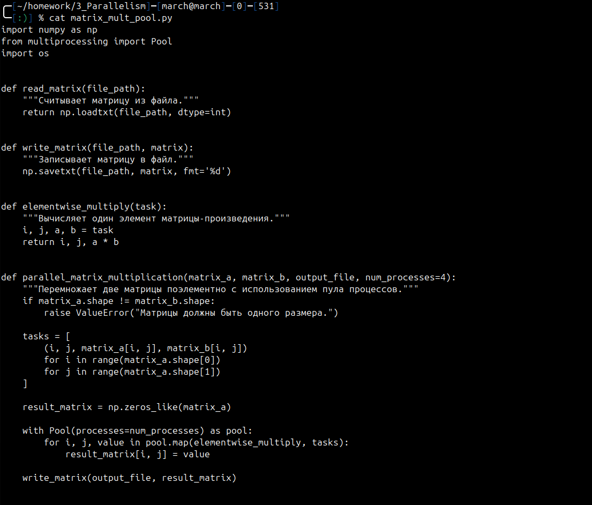
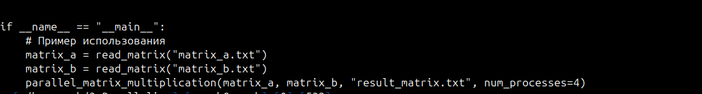

Созданы файлы `matrix_a.txt` и `matrix_b.txt` с таким содержимым:

```txt
  1 2 3
  4 5 6
  7 8 9
   ```

Запустим программу и проверим результат перемножения в файле `result_matrix.txt`:

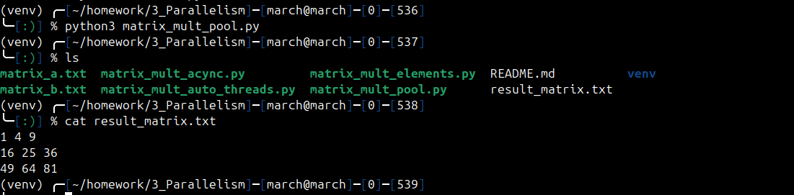

Модифицируем файл `matrix_mult_pool.py`, чтобы элементы результирующей матрицы записывались в промежуточный файл сразу по факту их вычисления. Модифицированный код запишем в новый файл `matrix_mult_elements.py`:

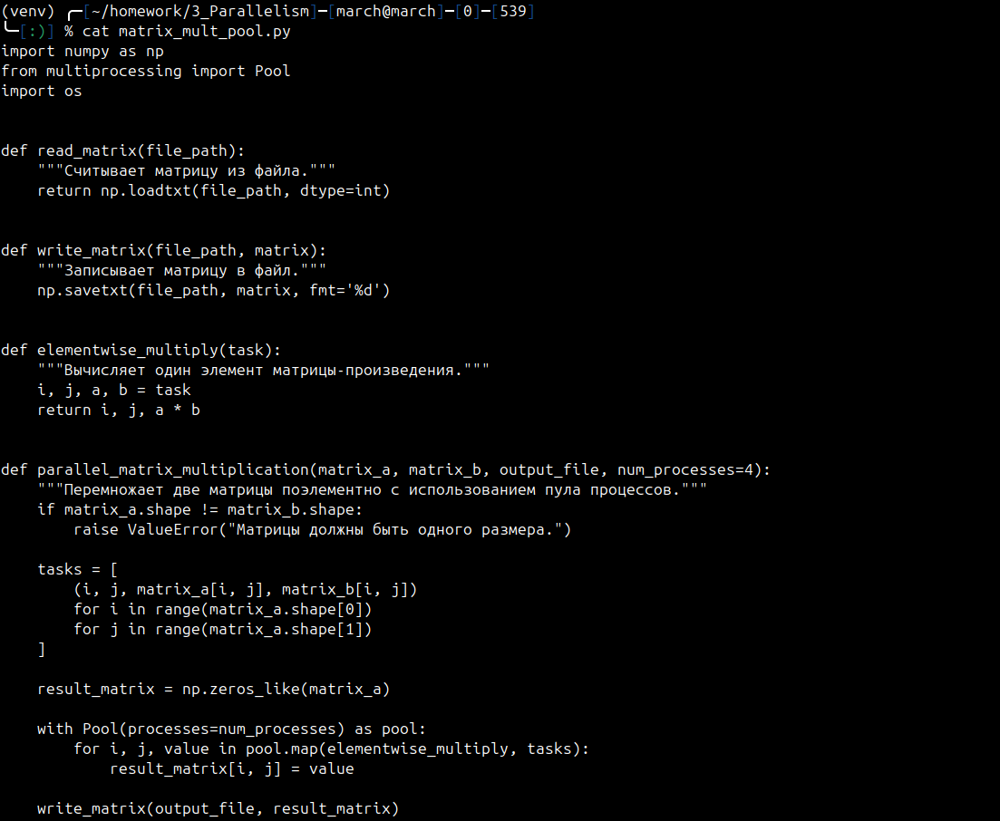
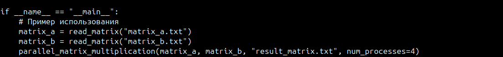

Каждый элемент матрицы-произведения записывается в файл `intermediate_file.txt` в виде строки: `строка,столбец,значение`.

Запустим программу и проверим, что было записано в промежуточный файл `intermediate_file.txt`. На ввод так же подаются `matrix_a.txt` и `matrix_b.txt`.
Также проверим результат перемножения в файле `intermediate_result.txt`:

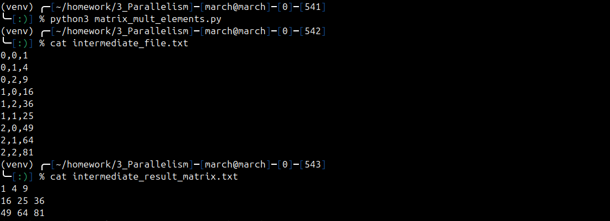
### Дополнительное задание 1

#### Модифицировать программу таким образом, чтобы она сама определяла количество необходимых параллельных потоков.

Для реализации этого задания воспользуемся функцией `cpu_count()` из модуля `multiprocessing`.

Чтобы сохранить все варианты кода, модифицированный код запишем в новый файл `matrix_mult_auto_threads.py`:

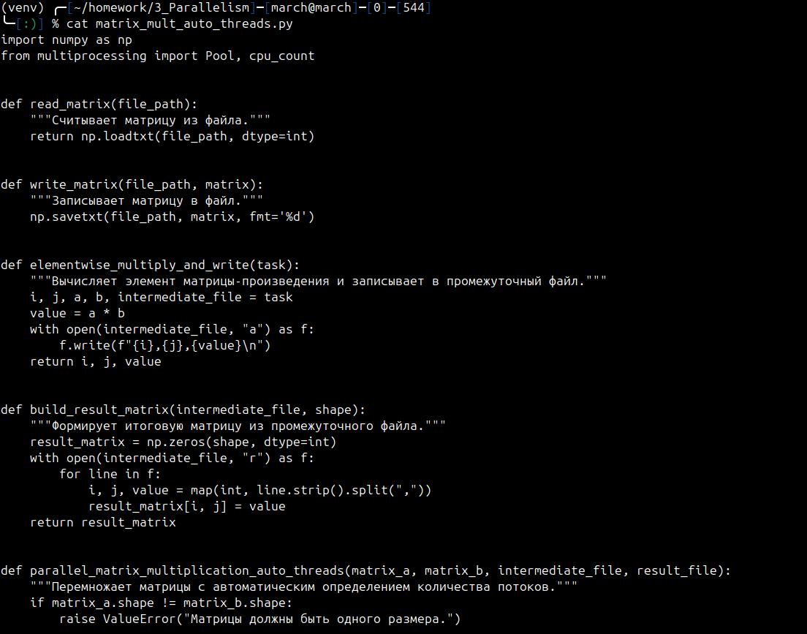
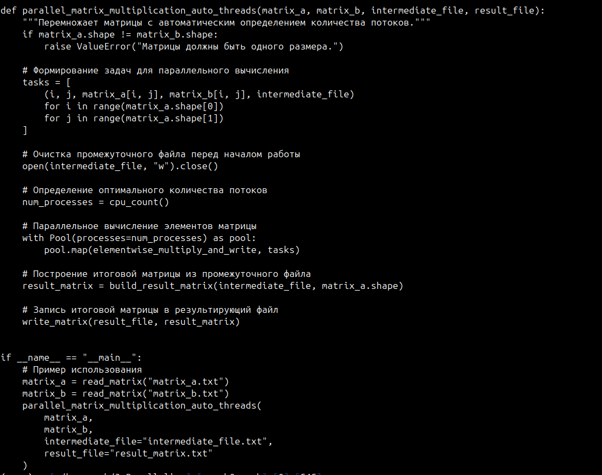

Запустим программу и проверим, что было записано в промежуточный файл `intermediate_file_threads.txt`. На ввод так же подаются `matrix_a.txt` и `matrix_b.txt`.
Также проверим результат перемножения в файле `result_matrix_threads.txt`:

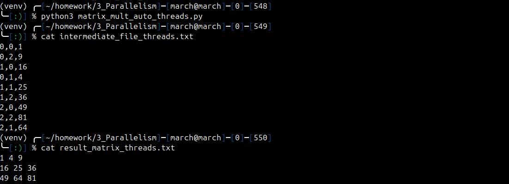

---

### Дополнительное задание 2

#### Модифицировать программу таким образом, чтобы одна часть программы генерировала случайные квадратные матрицы заданной размерности, а другая - перемножала их по мере генерации. Протестировать асинхронность работы программы. Реализовать механизм остановки процесса перемножения.

Чтобы сохранить все варианты кода, модифицированный код запишем в новый файл `matrix_mult_async.py`:

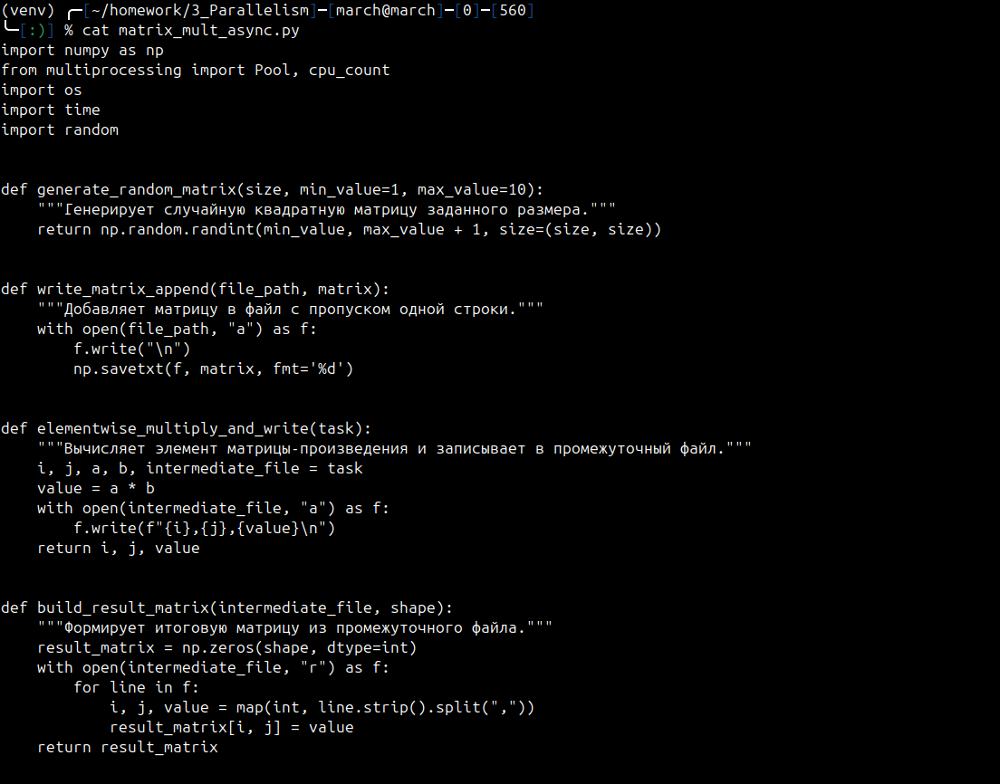
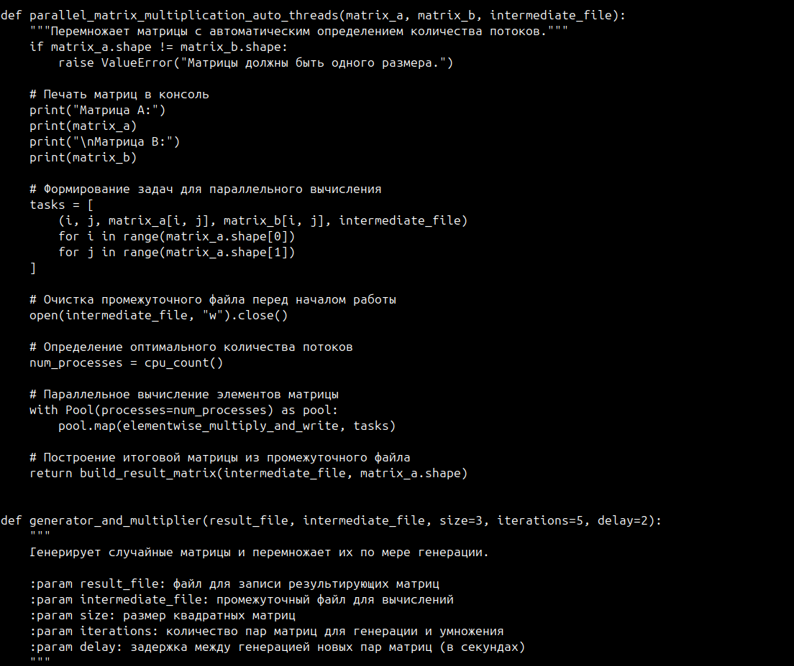
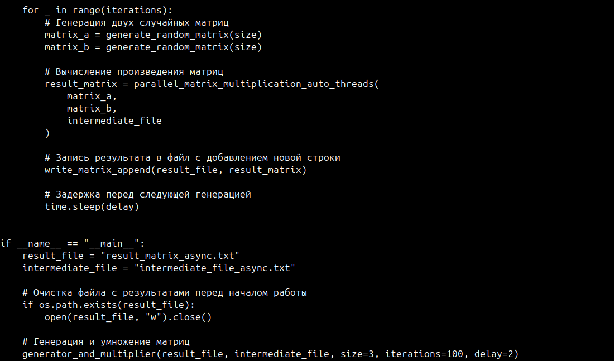

- Генерируются случайные матрицы заданной размерности.
- Реализована асинхронность: одна часть программы генерирует данные, другая обрабатывает их.
- Введён механизм остановки процессов с использованием события `Event`.

Для проверки работы функции требуется задать размерность квадратной матрицы в переменной `matrix_size`. 

**Зададим размерность 3.**

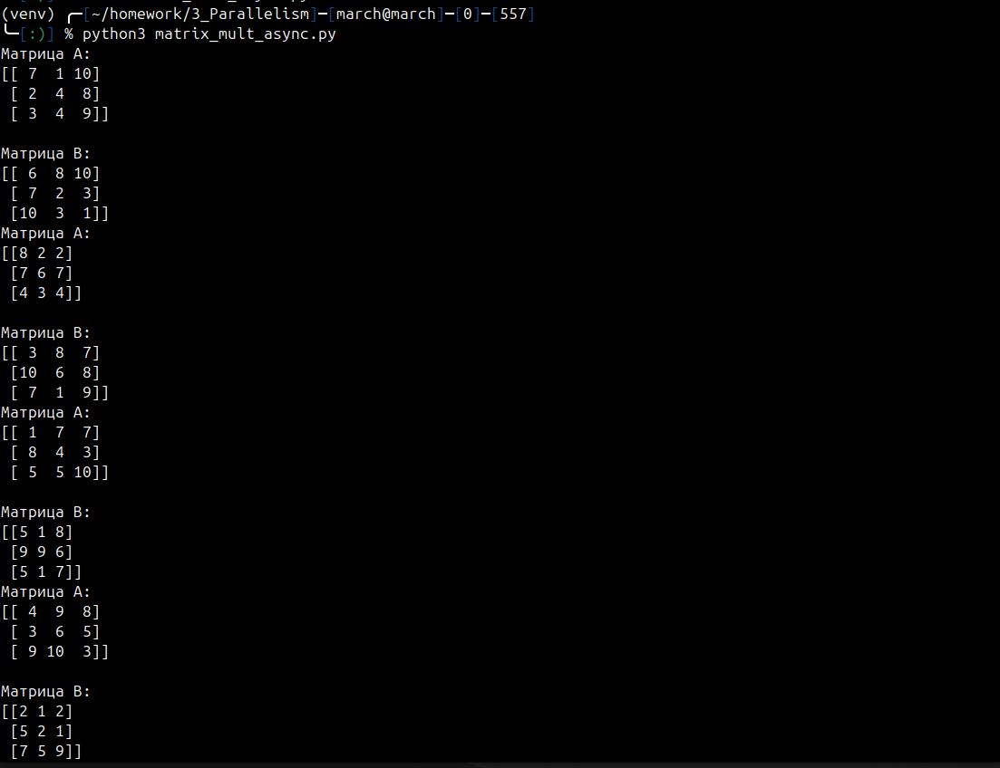

Запустим программу и проверим, что было записано в промежуточный файл `intermediate_file_async.txt`. 

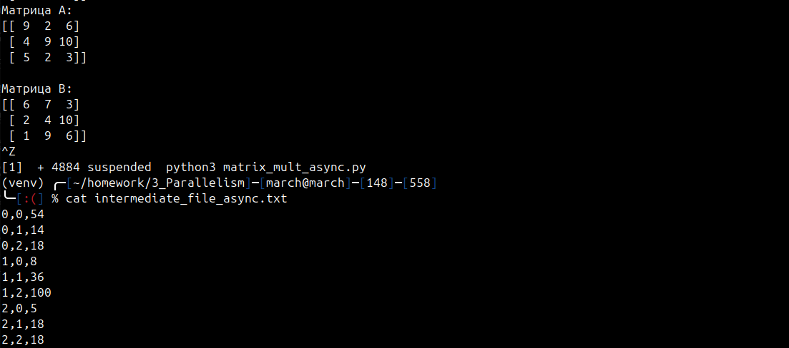

Здесь записан результат поэлементного умножения для последней пары сгенерированных матриц.

Также проверим результат перемножения в файле `result_matrix_async.txt`:

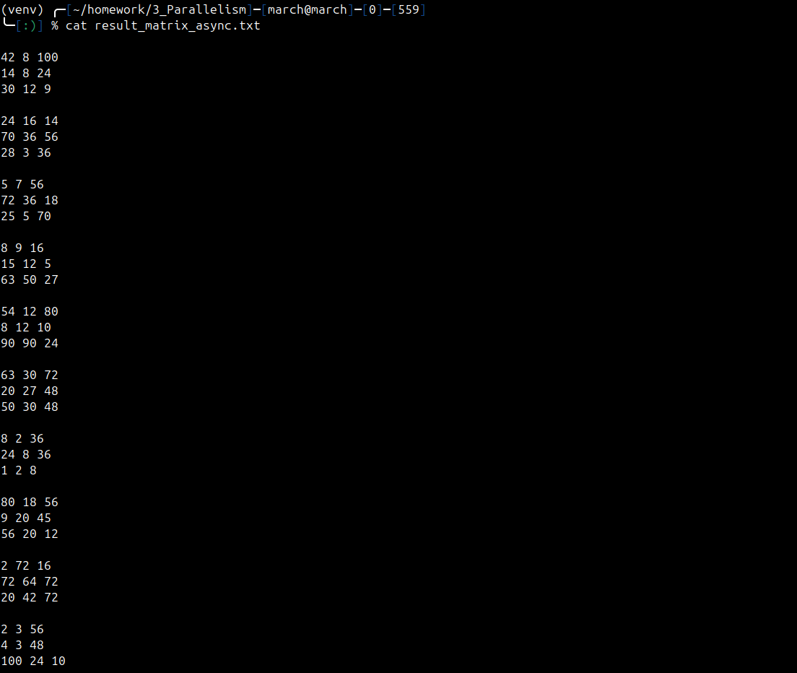

Здесь записаны результаты перемножения каждой сгенерированной пары матриц.
